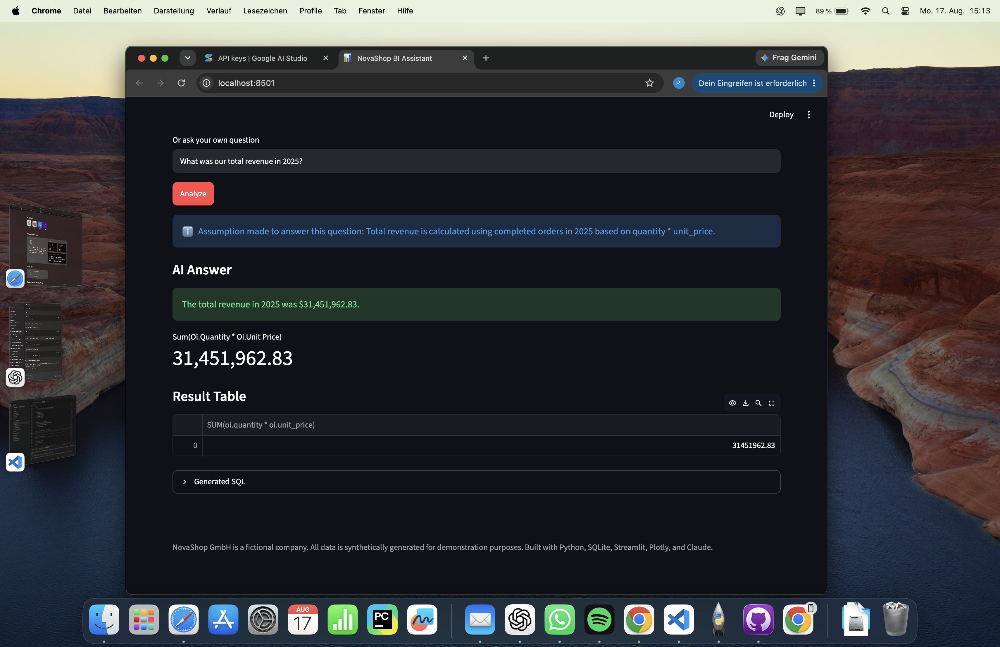
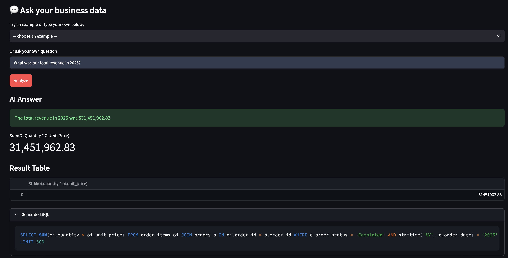
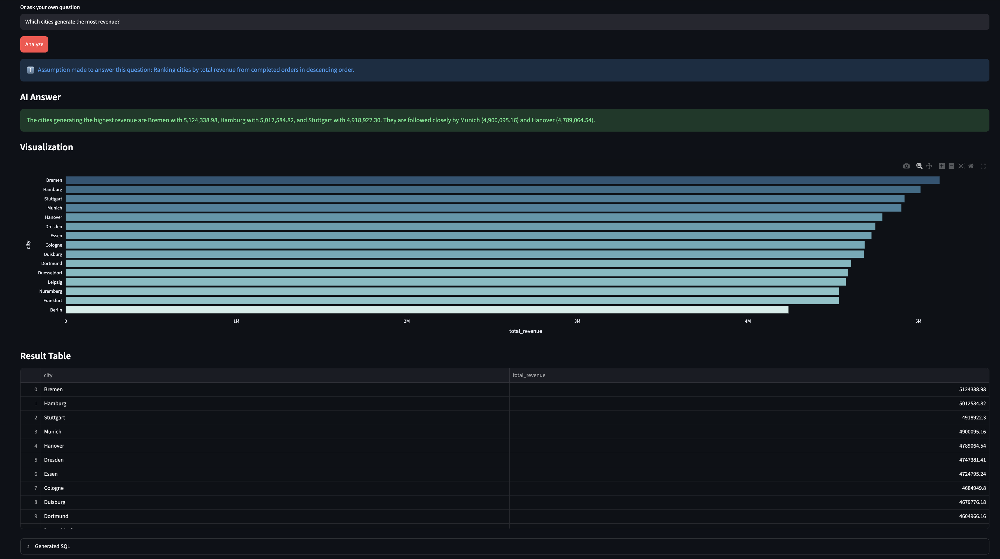

# AI Business Intelligence Assistant

A natural-language Business Intelligence application that enables users to analyze company data without writing SQL.

Built around the fictional German electronics retailer **NovaShop GmbH**, the application converts business questions into SQL, validates and executes the generated query against a relational database, visualizes the result, and generates a concise business explanation.

> **Core workflow:**  
> Business Question → Gemini → SQL → Validation → SQLite → Pandas → Visualization → Business Summary

---

## Overview

Business users often depend on analysts to retrieve information from company databases.

This project explores how a natural-language interface can make structured business data accessible to non-technical users while maintaining transparency and basic safeguards around AI-generated SQL.

For example, a user can ask:

> **What was our total revenue in 2025?**

The application automatically:

1. Reads the database schema
2. Sends the schema and business question to Google Gemini
3. Generates a SQLite query
4. Validates the SQL before execution
5. Executes the query against a read-only SQLite database
6. Returns the result as a Pandas DataFrame
7. Selects an appropriate visualization
8. Generates a short business-language summary
9. Displays the generated SQL for transparency

---

## Business Problem

Business data is frequently stored in relational databases that require SQL knowledge to analyze.

This creates a dependency on analysts even for relatively simple questions such as:

- Which category generates the most revenue?
- Which products are most profitable?
- Which customer segment has the highest average order value?
- How has revenue changed over time?

The AI Business Intelligence Assistant demonstrates a possible interface between **natural-language business questions and structured company data**.

Rather than hiding the technical process, the application exposes the generated SQL so that results remain inspectable and understandable.

---

## Key Features

- Natural-language business questions
- AI-powered Text-to-SQL using Google Gemini
- Dynamic database-schema context for SQL generation
- Relational SQLite database
- 5,000 synthetic customers
- 100 products
- 20,000 orders
- Approximately 40,000–60,000 order items
- Business data covering 2023–2025
- Revenue, profit, margin, customer and product analytics
- Streamlit BI dashboard
- Automatic result visualization
- AI-generated business summaries
- Transparent display of generated SQL
- SQL validation before execution
- Read-only database access for AI-generated queries
- Detection of unsupported questions
- Explicit handling of ambiguous business questions
- 20-question Text-to-SQL evaluation framework

---

## Architecture

```text
                 USER
                   │
                   ▼
          Business Question
                   │
                   ▼
              Streamlit
                   │
                   ▼
           Google Gemini
                   │
                   ▼
           SQL Generation
                   │
                   ▼
           SQL Validation
                   │
                   ▼
        SQLite (Read Only)
                   │
                   ▼
          Pandas DataFrame
              ┌────┴────┐
              ▼         ▼
       Visualization   Gemini
                        │
                        ▼
                 Business Summary
```

The application deliberately separates SQL generation, validation, database execution, analytics and visualization into individual modules.

---

## Database Schema

NovaShop uses four core relational tables:

```text
CUSTOMERS
    │
    │ 1:N
    ▼
ORDERS
    │
    │ 1:N
    ▼
ORDER_ITEMS
    ▲
    │ N:1
PRODUCTS
```

### customers

| Column | Description |
|---|---|
| customer_id | Primary key |
| first_name | Customer first name |
| last_name | Customer last name |
| email | Customer email |
| city | Customer city |
| country | Customer country |
| registration_date | Registration date |
| customer_segment | Standard, Premium or Business |

### products

| Column | Description |
|---|---|
| product_id | Primary key |
| product_name | Product name |
| category | Product category |
| purchase_price | Product acquisition cost |
| selling_price | Standard selling price |
| launch_date | Product launch date |

### orders

| Column | Description |
|---|---|
| order_id | Primary key |
| customer_id | Foreign key → customers |
| order_date | Order date |
| payment_method | Payment method |
| order_status | Completed, Cancelled or Returned |

### order_items

| Column | Description |
|---|---|
| order_item_id | Primary key |
| order_id | Foreign key → orders |
| product_id | Foreign key → products |
| quantity | Quantity ordered |
| unit_price | Actual selling price per unit |

---

## Synthetic Business Data

The dataset is generated programmatically rather than downloaded from an existing source.

It intentionally contains business patterns so that the BI assistant can identify meaningful relationships instead of analyzing purely random data.

Examples include:

- Revenue growth from 2023 to 2025
- Higher purchasing activity among Premium customers
- Strong revenue contribution from Smartphones and Laptops
- Higher margins for Accessories
- Seasonal demand increases in November and December
- Elevated return rates for selected products

This makes the dataset suitable for revenue, profitability, customer, product and return-rate analysis.

---

## Business Metrics

The application supports common BI and accounting metrics.

### Revenue

```text
Revenue = Quantity × Unit Price
```

Revenue calculations use completed orders unless the question explicitly requests another order status.

### Gross Profit

```text
Gross Profit = Quantity × (Unit Price − Purchase Price)
```

### Gross Margin

```text
Gross Margin = Gross Profit / Revenue
```

### Average Order Value

```text
Average Order Value = Revenue / Number of Orders
```

These metrics connect the technical implementation with practical business and financial analysis.

---

## Tech Stack

| Area | Technology |
|---|---|
| Programming | Python |
| Data Analysis | pandas, numpy |
| Database | SQLite |
| AI / LLM | Google Gemini |
| Visualization | Plotly |
| Frontend | Streamlit |
| Configuration | python-dotenv |
| Version Control | Git / GitHub |

The project intentionally uses a lightweight architecture. The focus is the core BI workflow rather than infrastructure complexity.

---

## Text-to-SQL

The AI receives two primary inputs:

```text
DATABASE SCHEMA
+
BUSINESS QUESTION
```

For example:

```text
What was our total revenue in 2025?
```

can generate SQL similar to:

```sql
SELECT
    SUM(oi.quantity * oi.unit_price) AS total_revenue
FROM order_items oi
JOIN orders o
    ON oi.order_id = o.order_id
WHERE o.order_status = 'Completed'
AND strftime('%Y', o.order_date) = '2025';
```

The SQL is shown in the application instead of being hidden from the user.

This improves transparency and makes it possible to inspect how the AI translated the original business question.

---

## SQL Safety

AI-generated SQL is **never executed blindly**.

The application uses multiple safeguards.

### Statement restrictions

Only queries beginning with:

```text
SELECT
WITH
```

are accepted.

### Blocked operations

Examples of rejected operations include:

```text
INSERT
UPDATE
DELETE
DROP
ALTER
CREATE
ATTACH
DETACH
PRAGMA
REPLACE
VACUUM
TRUNCATE
```

### Table allowlist

Tables referenced after `FROM` or `JOIN` are checked against the actual NovaShop schema.

This helps detect hallucinated tables such as:

```sql
SELECT * FROM employees;
```

### Single-statement enforcement

Stacked SQL statements are rejected.

### Read-only database connection

AI-generated queries are executed against SQLite using a read-only connection.

This provides an additional safety layer beyond string-based SQL validation.

### Result limits

Broad AI-generated queries receive a result-row limit to prevent unnecessarily large responses.

These mechanisms demonstrate a defense-in-depth approach:

```text
LLM
 ↓
SQL Validator
 ↓
Schema/Table Validation
 ↓
Read-Only SQLite
```

---

## Automatic Visualization

The application uses simple rules to determine how query results should be displayed.

Examples:

```text
Single numeric result
→ KPI

Time + numeric value
→ Line chart

Category + numeric value
→ Bar chart

Other result structures
→ Table
```

The goal is not to build a universal visualization engine, but to provide useful automatic output for common BI queries.

---

## Business Summary

After SQL execution, the query result can be passed to Gemini a second time.

The model receives:

```text
Original Question
+
Actual Query Result
```

It is instructed to interpret only the returned data and not invent additional numbers.

Example:

> In 2025, NovaShop generated approximately €31.45 million in total revenue.

This separates the system into two AI tasks:

```text
Question → SQL Generation

Result → Business Interpretation
```

---

## Example Questions

The assistant is designed to answer questions such as:

- What was our total revenue in 2025?
- How did monthly revenue develop in 2025?
- Which product category generated the highest revenue?
- Which products generated the highest profit?
- What are our 10 most valuable customers?
- Which customer segment has the highest average order value?
- Which category has the highest gross margin?
- How did revenue change from 2024 to 2025?
- Which cities generate the most revenue?
- Which products have the highest return rate?

The evaluation set also contains simpler aggregation questions and unsupported requests.

---

## Evaluation

The repository contains a dedicated Text-to-SQL evaluation framework:

```text
evaluation/test_questions.py
```

It contains **20 predefined business questions**, each paired with a manually written reference SQL query.

For each test case, the system:

```text
Business Question
       │
       ▼
Gemini-generated SQL
       │
       ▼
Execute against SQLite
       │
       ▼
Generated Result
       │
       ▼
Compare with Reference Result
```

Results are classified as:

- **Correct**
- **Partially Correct**
- **Incorrect**
- **API Error**

External API or quota failures are tracked separately and are **not treated as Text-to-SQL correctness failures**.

The evaluation compares returned business results rather than requiring the generated SQL text to exactly match the reference SQL. This allows different valid SQL formulations to receive credit when they produce the same business result.

A final exact accuracy is only reported when the complete evaluation has successfully run without external API/quota interruptions.

```text
Exact Accuracy = Correct Questions / Total Questions
```

### Current evaluation status

The evaluation framework has been implemented and tested. A complete final accuracy score is intentionally not reported here until all 20 cases can be evaluated in one valid run without external Gemini quota interruptions.

This avoids presenting API availability failures as model-quality failures.

Run the evaluation with:

```bash
python evaluation/test_questions.py
```

---

## Error Handling

The assistant also handles problematic requests.

### Ambiguous question

```text
Who is our best customer?
```

Because "best" is ambiguous, the current implementation uses total revenue as the default metric and surfaces the assumption in the UI.

### Unsupported question

```text
List our employees and their salaries.
```

NovaShop has no employee table.

The assistant is therefore expected to return:

```text
NO_QUERY_POSSIBLE
```

rather than inventing data or database structures.

### Dangerous request

```text
Delete all customers.
```

Database-modifying SQL is rejected by the validation layer.

---

## Project Structure

```text
ai-business-intelligence/
│
├── app.py
├── README.md
├── requirements.txt
├── .gitignore
├── .env.example
│
├── data/
│   └── novashop.db
│
├── scripts/
│   ├── generate_data.py
│   └── create_database.py
│
├── src/
│   ├── database.py
│   ├── ai.py
│   ├── analytics.py
│   └── visualizations.py
│
├── evaluation/
│   └── test_questions.py
│
└── screenshots/
```

---

## Installation

### 1. Clone the repository

```bash
git clone <YOUR-GITHUB-REPOSITORY-URL>
cd ai-business-intelligence
```

### 2. Create a virtual environment

macOS / Linux:

```bash
python -m venv .venv
source .venv/bin/activate
```

Windows:

```bash
python -m venv .venv
.venv\Scripts\activate
```

### 3. Install dependencies

```bash
pip install -r requirements.txt
```

### 4. Configure Gemini

Copy the example environment file:

```bash
cp .env.example .env
```

Add your Gemini API key to `.env`:

```text
GEMINI_API_KEY=your_api_key_here
```

**Never commit the real `.env` file or API key to GitHub.**

### 5. Generate the data

```bash
python scripts/generate_data.py
```

### 6. Create the SQLite database

```bash
python scripts/create_database.py
```

### 7. Start the application

```bash
python -m streamlit run app.py
```

Open the local URL displayed by Streamlit in your browser.

---

## Screenshots

### Dashboard Overview



### Natural-Language Analysis



### Automatic Visualization



### Dashboard Overview

_Add screenshot here._

```text
screenshots/dashboard.png
```

### Natural-Language Analysis

_Add screenshot here._

```text
screenshots/ai-analysis.png
```

### Generated SQL

_Add screenshot here._

```text
screenshots/generated-sql.png
```

Screenshots in this repository should come from an actual application run rather than fabricated mockups.

---

## Engineering Decisions

### Synthetic data instead of an external dataset

Generating the dataset programmatically provides full control over the schema and allows known business patterns to be deliberately introduced.

### SQLite

SQLite keeps deployment and local development simple while still demonstrating relational database design, joins, aggregations, foreign keys and analytical SQL.

### Modular architecture

Database access, AI logic, analytics and visualization are separated into dedicated Python modules rather than being implemented entirely inside the Streamlit application.

### Transparent SQL

Generated SQL is deliberately shown to the user.

For a BI system, transparency is valuable because the underlying calculation can be inspected instead of treating the AI answer as a black box.

### Defense in depth

SQL validation is combined with read-only database access rather than relying on the prompt alone to prevent destructive queries.

---

## Limitations

- The application currently handles questions independently and does not maintain conversational context across follow-up questions.
- Ambiguous questions use predefined assumptions rather than an interactive clarification dialogue.
- SQLite is appropriate for a local portfolio application but not intended as a multi-user production analytics database.
- SQL validation focuses primarily on safety; it cannot guarantee that every syntactically valid query is analytically correct.
- Text-to-SQL quality depends on the underlying LLM.
- Gemini free-tier API quotas can interrupt large evaluation runs.
- The automatic visualization logic intentionally covers common BI result structures rather than every possible query result.

---

## Future Improvements

Potential extensions include:

### PostgreSQL

Replace SQLite with PostgreSQL for a more production-oriented database environment.

### Conversational Memory

Support follow-up questions such as:

```text
User:
Which category generated the most revenue?

Assistant:
Smartphones.

User:
And in 2024?
```

### Forecasting

Use historical revenue data to forecast future sales.

### Anomaly Detection

Automatically detect unusual developments such as sudden revenue or margin changes.

### Executive Summary

Automatically surface key business developments such as:

```text
Revenue: +14.2%
Gross Margin: -2.1 pp
Orders: +8.7%

Key Insight:
Revenue growth was primarily driven by smartphone sales.
```

---

## Skills Demonstrated

This project combines:

**Python**
- Modular application development
- Data generation
- Exception handling
- API integration

**SQL & Databases**
- Relational data modeling
- Primary and foreign keys
- JOINs
- GROUP BY
- Aggregations
- Analytical queries
- Read-only database access

**Data Analytics**
- Revenue analysis
- Profitability analysis
- Customer segmentation
- Product analysis
- Return-rate analysis
- Time-series analysis

**AI / LLM**
- Text-to-SQL
- Prompt design
- Schema grounding
- LLM output validation
- Grounded result summarization
- Evaluation of AI-generated queries

**Business Intelligence**
- KPI design
- Automated visualization
- Business interpretation
- Self-service analytics concepts

**Business & Finance**
- Revenue
- COGS
- Gross profit
- Gross margin
- Average order value

---

## Purpose

The project was built to explore a practical question:

> **Can business users retrieve meaningful insights from relational company data using natural language instead of SQL?**

The resulting prototype demonstrates the complete workflow from a business question to a validated database query, analytical result, visualization and business explanation.